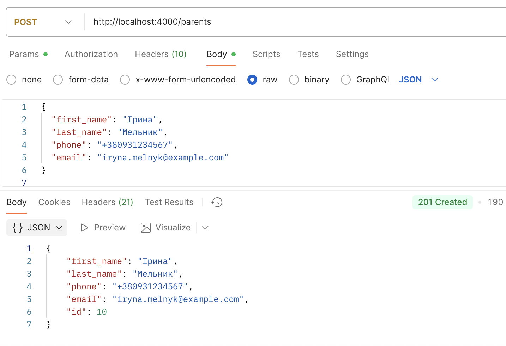
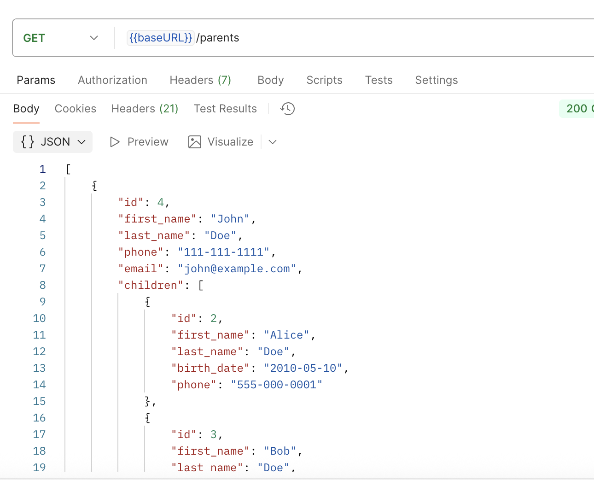
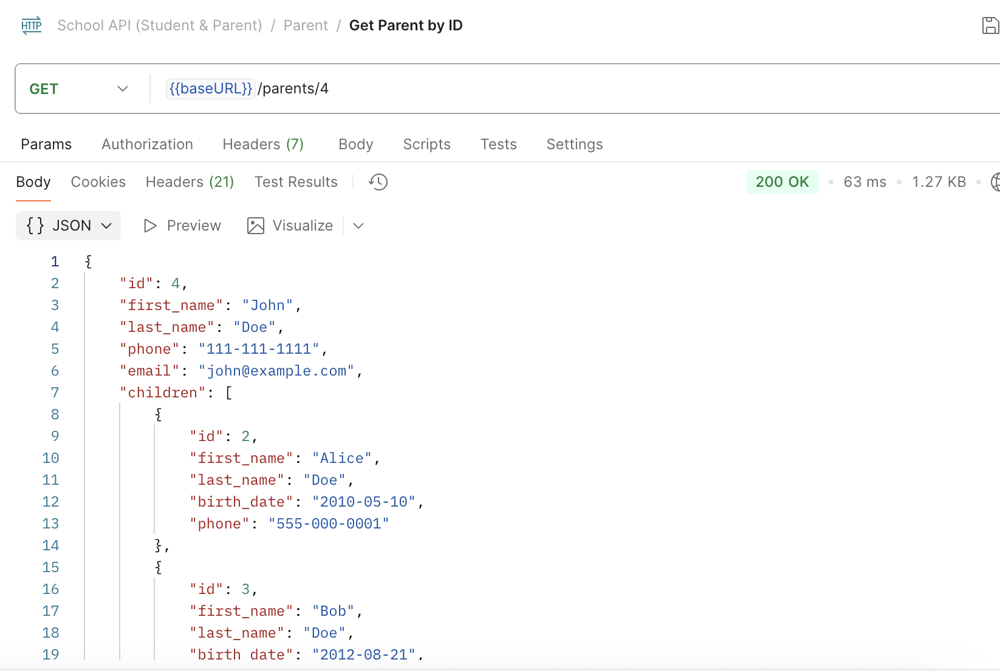
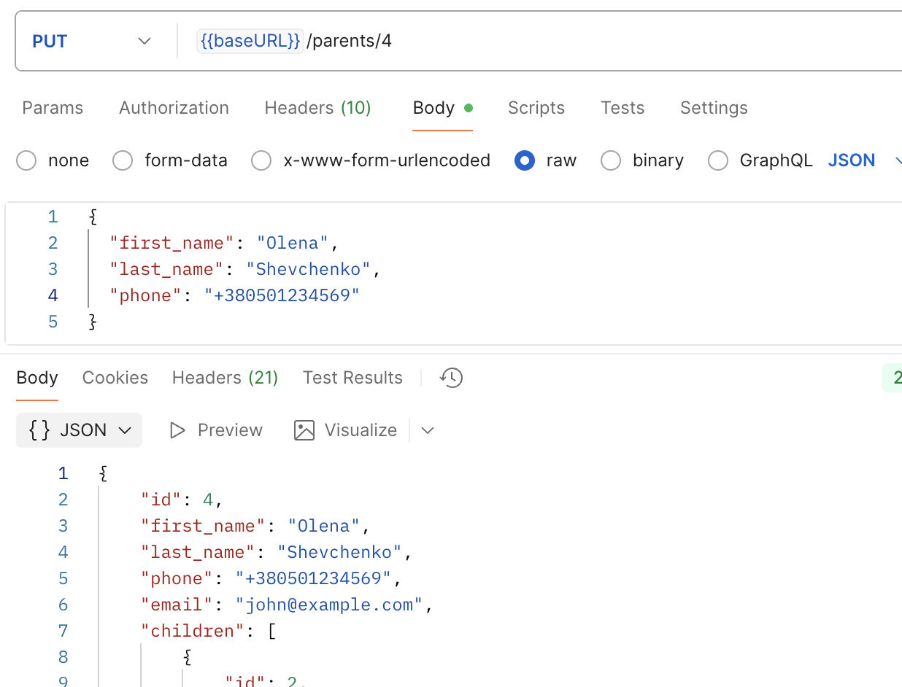
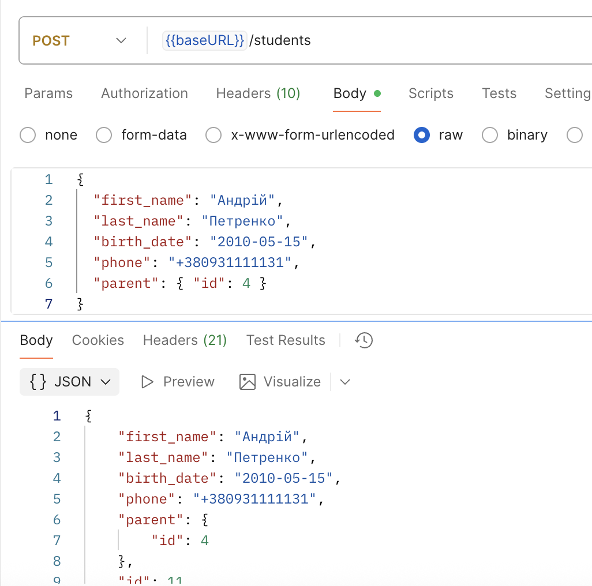
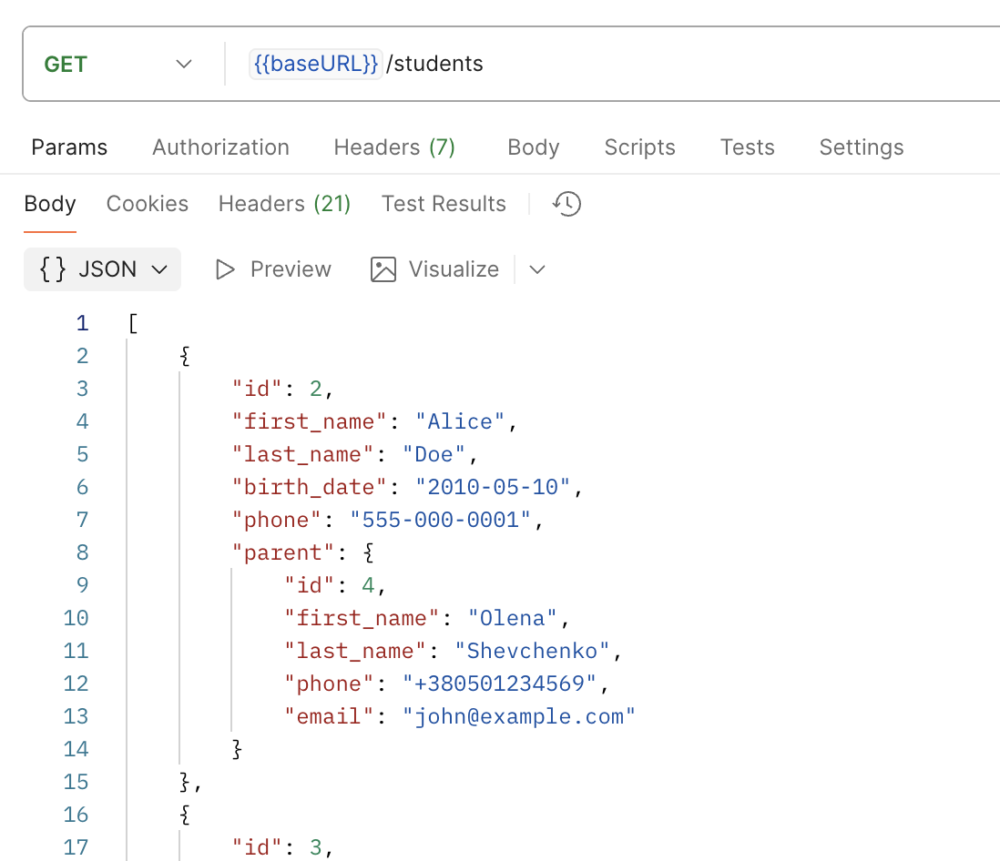
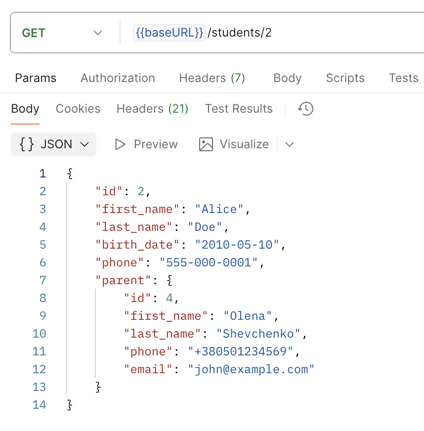
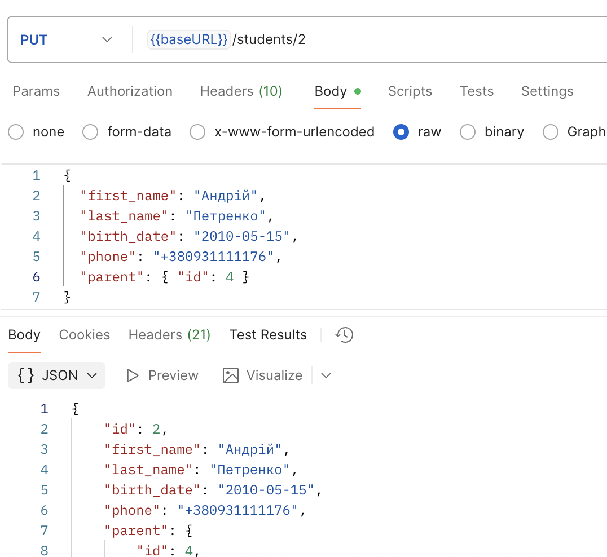
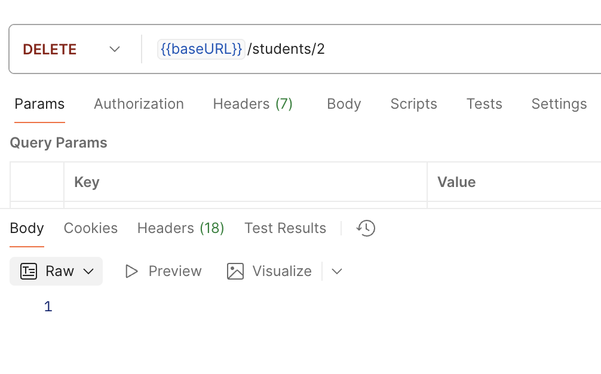

# 📘 Проєкт: Електронний журнал — Лабораторна робота 4

## 🧩 Короткий опис

Цей проєкт реалізує базову структуру бази даних для електронного журналу з використанням **TypeORM** і **PostgreSQL**.  
Реалізовано сутності **Батьків (Parent)** та **Учнів (Student)**, а також виконано початкове наповнення бази даних за допомогою **seed-міграції**.

---

## 🏗️ Реалізовані сутності

### 👨‍👩‍👧 Parent (Батьки)

| Поле         | Тип       | Опис                              |
| ------------ | --------- | --------------------------------- |
| `id`         | number    | Первинний ключ                    |
| `first_name` | string    | Ім'я батька/матері                |
| `last_name`  | string    | Прізвище батька/матері            |
| `phone`      | string    | Номер телефону                    |
| `email`      | string    | Електронна пошта                  |
| `students`   | Student[] | Зв’язок один-до-багатьох з учнями |

🔗 **Зв’язок:**  
**Parent (1) ↔ (∞) Student**

---

### 🧒 Student (Учні)

| Поле         | Тип    | Опис                              |
| ------------ | ------ | --------------------------------- |
| `id`         | number | Первинний ключ                    |
| `first_name` | string | Ім'я учня                         |
| `last_name`  | string | Прізвище учня                     |
| `birth_date` | Date   | Дата народження                   |
| `phone`      | string | Телефон учня або батьків          |
| `parent`     | Parent | Зв’язок багато-до-одного з Parent |

🔗 **Зв’язок:**  
**Student (∞) ↔ (1) Parent**

---

## 🌱 Наповнення бази даних (Seed)

Міграція `SeedParentsAndStudents1759870000000` створює початкові записи в таблицях:

### 👨‍👩‍👧 Приклади даних

**Батьки:**

- Олександр Іваненко — `+380501234567`
- Наталія Петренко — `+380671112233`
- Сергій Коваль — `+380931234321`

**Учні:**

- Андрій Іваненко — 2010-05-15
- Марія Петренко — 2011-03-22
- Дмитро Коваль — 2009-12-01

---

## 🌐 Реалізовані API ендпоінти

### 👨‍👩‍👧 Parent API

| Метод    | Ендпоінт       | Опис                             |
| -------- | -------------- | -------------------------------- |
| `GET`    | `/parents`     | Отримати список усіх батьків     |
| `GET`    | `/parents/:id` | Отримати дані конкретного батька |
| `POST`   | `/parents`     | Створити нового батька           |
| `PUT`    | `/parents/:id` | Оновити дані батька              |
| `DELETE` | `/parents/:id` | Видалити батька                  |

### 🧒 Student API

| Метод    | Ендпоінт        | Опис                           |
| -------- | --------------- | ------------------------------ |
| `GET`    | `/students`     | Отримати список усіх учнів     |
| `GET`    | `/students/:id` | Отримати дані конкретного учня |
| `POST`   | `/students`     | Створити нового учня           |
| `PUT`    | `/students/:id` | Оновити дані учня              |
| `DELETE` | `/students/:id` | Видалити учня                  |

---

## ⚙️ Запуск seed-міграції

1. Зібрати проєкт:
   ```bash
   npm run build
   ```

# Результати роботи

## POST parents



## GET parents



## GET parents/4



## PUT parents/4



## POST students



## GET students



## GET students/2



## PUT students/2



## DELETE students/2


