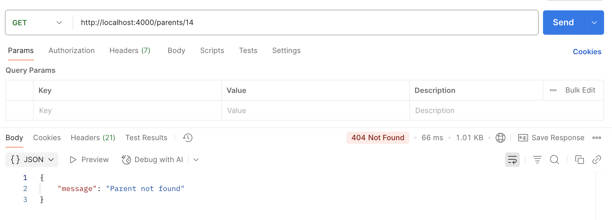

# Електронний журнал

## Короткий опис

Цей проєкт реалізує базову структуру бази даних для електронного журналу з використанням **TypeORM** і **PostgreSQL**.  
Реалізовано сутності **Батьків (Parent)** та **Учнів (Student)**, а також виконано початкове наповнення бази даних за допомогою **seed-міграції**.

---

## Реалізовані сутності

### Parent (Батьки)

| Поле         | Тип       | Опис                              |
| ------------ | --------- | --------------------------------- |
| `id`         | number    | Первинний ключ                    |
| `first_name` | string    | Ім'я батька/матері                |
| `last_name`  | string    | Прізвище батька/матері            |
| `phone`      | string    | Номер телефону                    |
| `email`      | string    | Електронна пошта                  |
| `students`   | Student[] | Зв’язок один-до-багатьох з учнями |

**Зв’язок:**  
**Parent (1) ↔ (∞) Student**

---

### Student (Учні)

| Поле         | Тип    | Опис                              |
| ------------ | ------ | --------------------------------- |
| `id`         | number | Первинний ключ                    |
| `first_name` | string | Ім'я учня                         |
| `last_name`  | string | Прізвище учня                     |
| `birth_date` | Date   | Дата народження                   |
| `phone`      | string | Телефон учня або батьків          |
| `parent`     | Parent | Зв’язок багато-до-одного з Parent |

**Зв’язок:**  
**Student (∞) ↔ (1) Parent**

---

## Наповнення бази даних (Seed)

Міграція `SeedParentsAndStudents1759870000000` створює початкові записи в таблицях:

### Приклади даних

**Батьки:**

- Олександр Іваненко — `+380501234567`
- Наталія Петренко — `+380671112233`
- Сергій Коваль — `+380931234321`

**Учні:**

- Андрій Іваненко — 2010-05-15
- Марія Петренко — 2011-03-22
- Дмитро Коваль — 2009-12-01

---

## Реалізовані API ендпоінти

### Parent API

| Метод    | Ендпоінт       | Опис                             |
| -------- | -------------- | -------------------------------- |
| `GET`    | `/parents`     | Отримати список усіх батьків     |
| `GET`    | `/parents/:id` | Отримати дані конкретного батька |
| `POST`   | `/parents`     | Створити нового батька           |
| `PUT`    | `/parents/:id` | Оновити дані батька              |
| `DELETE` | `/parents/:id` | Видалити батька                  |

### Student API

| Метод    | Ендпоінт        | Опис                           |
| -------- | --------------- | ------------------------------ |
| `GET`    | `/students`     | Отримати список усіх учнів     |
| `GET`    | `/students/:id` | Отримати дані конкретного учня |
| `POST`   | `/students`     | Створити нового учня           |
| `PUT`    | `/students/:id` | Оновити дані учня              |
| `DELETE` | `/students/:id` | Видалити учня                  |

---

## Запуск seed-міграції

1. Зібрати проєкт:
   ```bash
   npm run build
   ```

# Результати роботи

## POST parents


## GET parents


## GET parents/4


## PUT parents/4


## POST students


## GET students


## GET students/2


## PUT students/2


## DELETE students/2


# №6

# Пояснення ролі шарів у застосунку

## Middleware (валідація)

**Роль:**  
Middleware перевіряє запит перед тим, як він потрапить у контролер.  
Зазвичай тут проводиться **валідація даних**, **автентифікація**, **логування** або **обробка помилок**.  
Якщо дані некоректні — middleware завершує обробку запиту, не передаючи його далі.

**Приклад middleware-функції (валідація DTO):**

```typescript
import { Request, Response, NextFunction } from 'express';
import { isEmpty, isEmail, isMobilePhone } from 'validator';

export async function validateCreateParent(req: Request, _res: Response, next: NextFunction) {
  const { first_name, last_name, phone, email } = req.body;

  if (isEmpty(first_name || '')) {
    return next(new Error('first_name is required'));
  }

  if (isEmpty(last_name || '')) {
    return next(new Error('last_name is required'));
  }

  if (!isMobilePhone(phone || '', 'uk-UA')) {
    return next(new Error('phone must be a valid Ukrainian phone number'));
  }

  if (!isEmail(email || '')) {
    return next(new Error('email must be valid'));
  }

  return next();
}
```

## Controller (оркестрація)

**Роль:**
Контролер приймає HTTP-запит, викликає відповідні методи сервісу і повертає відповідь клієнту.
Він не містить бізнес-логіки — лише координує потік даних між шарами.

## Service (бізнес-логіка)

**Роль:**
Сервіс реалізує основну логіку програми: обробку даних, перевірки, взаємодію з репозиторіями.
Контролери не знають, як саме виконується логіка — тільки звертаються до сервісів.

## Repository (доступ до даних)

**Роль:**
Сервіс реалізує основну логіку програми: обробку даних, перевірки, взаємодію з репозиторіями.
Контролери не знають, як саме виконується логіка — тільки звертаються до сервісів.

## Приклад Response DTO

**Роль**
DTO (Data Transfer Object) формує структуру відповіді API.
Він відділяє внутрішні сутності бази від того, що повертається користувачу.

```typescript
import { Parent } from '../orm/entities/users/Parent.entity';
import { StudentResponseDTO } from './student.dto';

export class ParentResponseDTO {
  id: number;
  firstName: string;
  lastName: string;
  phone: string;
  email: string;
  children?: StudentResponseDTO[];

  constructor(parent: Parent) {
    this.id = parent.id;
    this.firstName = parent.first_name;
    this.lastName = parent.last_name;
    this.phone = parent.phone;
    this.email = parent.email;

    if (parent.children) {
      this.children = parent.children.map((child) => new StudentResponseDTO(child));
    }
  }
}

import { IsString, IsEmail, IsOptional } from 'class-validator';

export class CreateParentDto {
  @IsString()
  first_name: string;

  @IsString()
  last_name: string;

  @IsString()
  phone: string;

  @IsEmail()
  email: string;
}

export class UpdateParentDto {
  @IsOptional()
  @IsString()
  first_name?: string;

  @IsOptional()
  @IsString()
  last_name?: string;

  @IsOptional()
  @IsString()
  phone?: string;

  @IsOptional()
  @IsEmail()
  email?: string;
}
```

## POST /parents - invalid


## POST /parents - valid


## GET /parents/14 - invalid



## GET /parents/14 - valid


